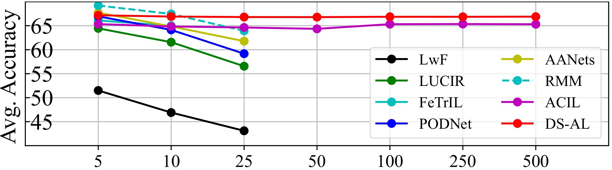
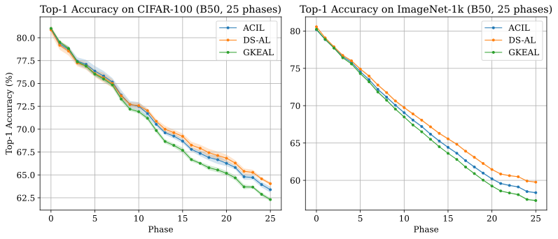

中文 ｜ [English](README.md)

# 解析持续学习 (Analytic Continual Learning)

该项目的工作已被发表在以下论文中：

[1] Zhuang, Huiping, et al. "[ACIL: Analytic class-incremental learning with absolute memorization and privacy protection.](https://proceedings.neurips.cc/paper_files/paper/2022/hash/4b74a42fc81fc7ee252f6bcb6e26c8be-Abstract-Conference.html)" Advances in Neural Information Processing Systems 35 (2022): 11602-11614.

[2] Zhuang, Huiping, et al. "[GKEAL: Gaussian kernel embedded analytic learning for few-shot class incremental task.](https://openaccess.thecvf.com/content/CVPR2023/html/Zhuang_GKEAL_Gaussian_Kernel_Embedded_Analytic_Learning_for_Few-Shot_Class_Incremental_CVPR_2023_paper.html)" Proceedings of the IEEE/CVF Conference on Computer Vision and Pattern Recognition. 2023.

[3] Zhuang, Huiping, et al. "[DS-AL: A Dual-Stream Analytic Learning for Exemplar-Free Class-Incremental Learning.](https://ojs.aaai.org/index.php/AAAI/article/view/29670)" Proceedings of the AAAI Conference on Artificial Intelligence. Vol. 38. No. 15. 2024.

[4] Zhuang, Huiping, et al. "[G-ACIL: Analytic Learning for Exemplar-Free Generalized Class Incremental Learning](https://arxiv.org/abs/2403.15706)" arXiv preprint arXiv:2403.15706 (2024).

[5] Zhuang, Huiping, et al. "[Online Analytic Exemplar-Free Continual Learning with Large Models for Imbalanced Autonomous Driving Task](https://arxiv.org/abs/2405.17779)" arXiv preprint arXiv:2405.17779 (2024).

[6] Fang, Di, et al. "[AIR: Analytic Imbalance Rectifier for Continual Learning.](https://arxiv.org/abs/2408.10349)" arXiv preprint arXiv:2408.10349 (2024).



**欢迎加入我们的交流QQ群: [954528161](http://qm.qq.com/cgi-bin/qm/qr?_wv=1027&k=qaK4W8Jw6d--VWHlx7iUs93T2qMJT9k_&authKey=5e8hSXX8rALjM12iGwrZ9BmRBP9iUfCuRGNCaZ3%2Bx0msiRFVcSwu%2FuZpeKig1XQH&noverify=0&group_code=954528161)。中文解读教程可以在[Bilibili](https://www.bilibili.com/video/BV1wq421A7YM/)中观看。**

## 解析学习的另一分支：解析联邦学习
我们开源了解析学习的另一分支——“[解析联邦学习](https://github.com/ZHUANGHP/Analytic-federated-learning)”相关的工作。

## 环境配置 (Environment)
我们建议使用[Anaconda](https://anaconda.org/)来配置运行环境。

```bash
git clone --depth=1 git@github.com:ZHUANGHP/Analytic-continual-learning.git

cd Analytic-continual-learning
conda env create -f environment.yaml
conda activate AL

mkdir backbones
```

您可以从[这里](https://github.com/ZHUANGHP/Analytic-continual-learning/releases)下载预训练模型，来快速上手体验我们的算法。我们建议将预训练的骨干网络（backbone）提取在`backbones`文件夹下。

对于使用macOS系统或使用CPUs计算的用户，您需要删除`environment.yaml`文件中有关CUDA的项。

我们强烈建议您在Linux中运行我们的算法。当然如果Windows和macOS用户在运行时遇到任何问题也欢迎提交Issues。

## 快速开始 (Quick Start)
在开始体验算法之前，请您先将基础训练权重（该[发布页](https://github.com/ZHUANGHP/Analytic-continual-learning/releases)中提供）放入`backbones`目录。由于本算法持续学习阶段不需要进行梯度计算，**您甚至可以在CPUs上运行我们的代码。**

这是一些参考案例：

```bash
# ACIL (CIFAR-100, B50 25 phases)
python main.py ACIL --dataset CIFAR-100 --base-ratio 0.5 --phases 25 \
    --data-root ~/dataset --IL-batch-size 4096 --num-workers 16 --backbone resnet32 \
    --gamma 0.1 --buffer-size 8192 \
    --cache-features --backbone-path ./backbones/resnet32_CIFAR-100_0.5_None
```
```bash
# G-ACIL (CIFAR-100, B50 25 phases)
python main.py G-ACIL --dataset CIFAR-100 --base-ratio 0.5 --phases 25 \
    --data-root ~/dataset --IL-batch-size 4096 --num-workers 16 --backbone resnet32 \
    --gamma 0.1 --buffer-size 8192 \
    --cache-features --backbone-path ./backbones/resnet32_CIFAR-100_0.5_None
```
```bash
# GKEAL (CIFAR-100, B50 10 phases)
python main.py GKEAL --dataset CIFAR-100 --base-ratio 0.5 --phases 10 \
    --data-root ~/dataset --IL-batch-size 4096 --num-workers 16 --backbone resnet32 \
    --gamma 0.1 --sigma 10 --buffer-size 8192 \
    --cache-features --backbone-path ./backbones/resnet32_CIFAR-100_0.5_None
```
```bash
# DS-AL (CIFAR-100, B50 50 phases)
python main.py DS-AL --dataset CIFAR-100 --base-ratio 0.5 --phases 50 \
    --data-root ~/dataset --IL-batch-size 4096 --num-workers 16 --backbone resnet32 \
    --gamma 0.1 --gamma-comp 0.1 --compensation-ratio 0.6 --buffer-size 8192 \
    --cache-features --backbone-path ./backbones/resnet32_CIFAR-100_0.5_None
```
```bash
# DS-AL (ImageNet-1k, B50 20 phases)
python main.py DS-AL --dataset ImageNet-1k --base-ratio 0.5 --phases 20 \
    --data-root ~/dataset --IL-batch-size 4096 --num-workers 16 --backbone resnet18 \
    --gamma 0.1 --gamma-comp 0.1 --compensation-ratio 1.5 --buffer-size 16384 \
    --cache-features --backbone-path ./backbones/resnet18_ImageNet-1k_0.5_None
```

## 从零开始训练 (Training From Scratch)

```bash
# ACIL (CIFAR-100)
python main.py ACIL --dataset CIFAR-100 --base-ratio 0.5 --phases 25 \
    --data-root ~/dataset --batch-size 256 --num-workers 16 --backbone resnet32 \
    --learning-rate 0.5 --label-smoothing 0 --base-epochs 300 --weight-decay 5e-4 \
    --gamma 0.1 --buffer-size 8192 --cache-features --IL-batch-size 4096
```
```bash
# ACIL (ImageNet-1k)
python main.py ACIL --dataset ImageNet-1k --base-ratio 0.5 --phases 25 \
    --data-root ~/dataset --batch-size 256 --num-workers 16 --backbone resnet18 \
    --learning-rate 0.5 --label-smoothing 0.05 --base-epochs 300 --weight-decay 5e-5 \
    --gamma 0.1 --buffer-size 16384 --cache-features --IL-batch-size 4096
```

## 复现的细节 (Reproduction Details)

### ACIL与G-ACIL之间的区别

G-ACIL是用于一般CIL设置的ACIL的通用版本。在传统的CIL任务上，G-ACIL相当于ACIL。因此我们在本仓库中使用了相同的实现。

### 基准测试(B50，25阶段，使用`TrivialAugmentWide`)

以下指标有95%的置信水平($\mu \pm 1.96\sigma$)：

|   Dataset   |    Method     | Backbone  | Buffer Size | Average Accuracy (%) | Last Phase Accuracy (%) |
| :---------: | :-----------: | :-------: | :---------: | :------------------: | :---------------------: |
|  CIFAR-100  | ACIL & G-ACIL | ResNet-32 |    8192     |   $71.047\pm0.252$   |    $63.384\pm0.330$     |
|  CIFAR-100  |     DS-AL     | ResNet-32 |    8192     |   $71.277\pm0.251$   |    $64.043\pm0.184$     |
|  CIFAR-100  |     GKEAL     | ResNet-32 |    8192     |   $70.371\pm0.168$   |    $62.301\pm0.191$     |
| ImageNet-1k | ACIL & G-ACIL | ResNet-18 |    16384    |   $67.497\pm0.092$   |    $58.349\pm0.111$     |
| ImageNet-1k |     DS-AL     | ResNet-18 |    16384    |   $68.354\pm0.084$   |    $59.762\pm0.086$     |
| ImageNet-1k |     GKEAL     | ResNet-18 |    16384    |   $66.881\pm0.061$   |    $57.295\pm0.105$     |



### 超参数(持续学习阶段)
在算法的持续学习阶段中，骨干网络（backbone）是被冻结的。您可以使用`--cache-features`选项保存骨干网络输出的特征，以提高参数调整的效率。下面列出了一些重要的超参数：

1. **Buffer Size**

    对于ACIL，缓冲区（buffer）大小表示随机投影层的 *扩展尺寸（expansion size）* 。对于GKEAL，缓冲区大小是指 *高斯核嵌入（Gaussian kernel embedding）* 的 *中心向量（center vectors）* 的个数。在DS-AL中，我们将“随机投影（random projection）”和“高斯投影（Gaussian projection）”均归为“缓冲区”这一概念。

    在大多数数据集上，随着缓冲区大小的增加，本算法的性能先增加后降低，您可以在我们的论文中看到关于这个超参数的详细实验。根据实验，我们建议在CIFAR-100上将缓冲区大小设置为8192，在ImageNet-1k上将缓冲区大小设置为16384或更大，以获得最佳性能。当然，较大的缓冲区大小代表着更多的内存占用。

2. **$\gamma$(正则化项的系数)**

    对于论文中使用的数据集， $\gamma$ 在一定范围内不敏感。但是，太小的 $\gamma$ 可能会导致矩阵求逆过程所得数值不稳定，而太大的 $\gamma$ 可能会导致分类器欠拟合。根据实验，我们在CIFAR-100和ImageNet-1k上将 $\gamma$ 均设置为0.1。若您计划将我们的算法应用到其他数据集时，我们还是建议您做一些实验以检查 $\gamma$ 是否合适，避免无法充分发挥算法性能。

3. **$\beta$ and $\sigma$(只在GKEAL中设置)**

    在GKEAL中，宽度调整（width-adjusting）参数 $\beta$ 控制高斯核（Gaussian kernels）的宽度。对于CIFAR-100和ImageNet-1k， $\sigma$ 设置在 $[5, 15]$ 左右时效果会较好，这里有转换关系 $\beta = \frac{1}{2\sigma^2}$ 。

4. **Compensation Ratio $\mathcal{C}$(只在DS-AL中设置)**

    我们建议使用网格搜索（grid search）在区间 $[0,2]$ 中找到最佳补偿比（compensation ratio）。根据实验，我们建议在CIFAR-100和ImageNet-1k上分别将补偿比设置为0.6和1.5。

更为详细的超参数设置工作您可以在我们的论文中查阅。

### 超参数(基础训练阶段)
在基础训练阶段中，骨干网络在CIFAR-100 (ResNet-32)和ImageNet-1k (ResNet-18)的前半数据集上达到了80%以上的top-1准确率。下面列出了一些重要的超参数：

1. **Learning Rate**

    在本仓库实现中，我们使用了“余弦调整器（cosine scheduler）”，而不是像论文中那样使用“分段平滑调整器（piece-wise smooth scheduler）”，这可以有效的减少需要设置的超参数数量。我们建议在CIFAR-100和ImageNet-1k上将学习率设置为0.5（当批大小为256时）以获得更好的收敛性。此外，提供的骨干网络训练的epoch数是300。

2. **Label Smoothing and Weight Decay**

    适当的设置标签平滑（label smoothing）和权重衰减（weight decay）可以防止骨干网络过拟合。有关标签平滑，在CIFAR-100中设置该参数没有显著的效果，在ImageNet-1k中我们设置为0.05；有关权重衰减，在CIFAR-100中我们设置为5e-4，在ImageNet-1k中我们设置为5e-5。

3. **Image Augmentation**

    在基础训练数据集中使用图像增强可以获得有更好泛化能力的骨干网络，能够显著提高性能。在论文的实验中，我们并没有使用图像增强。而在本仓库实现中，默认情况下我们设置启用了数据增强。**因此使用本仓库实现有着相比论文中指标更高的性能（约2%~5%）。**

    请注意，在重新对齐（re-alignment）和持续学习过程中，由于每个样本只学习一次，我们没有使用任何数据增强。

# 欢迎引用我们的论文

```bib
@InProceedings{ACIL_Zhuang_NeurIPS2022,
    author    = {ZHUANG, HUIPING and Weng, Zhenyu and Wei, Hongxin and XIE, RENCHUNZI and Toh, Kar-Ann and Lin, Zhiping},
    title     = {{ACIL}: Analytic Class-Incremental Learning with Absolute Memorization and Privacy Protection},
    booktitle = {Advances in Neural Information Processing Systems},
    editor    = {S. Koyejo and S. Mohamed and A. Agarwal and D. Belgrave and K. Cho and A. Oh},
    pages     = {11602--11614},
    publisher = {Curran Associates, Inc.},
    url       = {https://proceedings.neurips.cc/paper_files/paper/2022/file/4b74a42fc81fc7ee252f6bcb6e26c8be-Paper-Conference.pdf},
    volume    = {35},
    year      = {2022}
}

@InProceedings{GKEAL_Zhuang_CVPR2023,
    author    = {Zhuang, Huiping and Weng, Zhenyu and He, Run and Lin, Zhiping and Zeng, Ziqian},
    title     = {{GKEAL}: Gaussian Kernel Embedded Analytic Learning for Few-Shot Class Incremental Task},
    booktitle = {Proceedings of the IEEE/CVF Conference on Computer Vision and Pattern Recognition (CVPR)},
    month     = {June},
    year      = {2023},
    pages     = {7746-7755},
    url       = {https://openaccess.thecvf.com/content/CVPR2023/papers/Zhuang_GKEAL_Gaussian_Kernel_Embedded_Analytic_Learning_for_Few-Shot_Class_Incremental_CVPR_2023_paper.pdf}
}

@article{DSAL_Zhuang_AAAI2024,
    title     = {{DS-AL}: A Dual-Stream Analytic Learning for Exemplar-Free Class-Incremental Learning},
    author    = {Zhuang, Huiping and He, Run and Tong, Kai and Zeng, Ziqian and Chen, Cen and Lin, Zhiping},
    journal   = {Proceedings of the AAAI Conference on Artificial Intelligence},
    volume    = {38},
    number    = {15},
    pages     = {17237-17244},
    year      = {2024},
    month     = {Mar.},
    DOI       = {10.1609/aaai.v38i15.29670},
    url       = {https://ojs.aaai.org/index.php/AAAI/article/view/29670},
}

@misc{GACIL_Zhuang_arXiv2024,
    title         = {{G-ACIL}: Analytic Learning for Exemplar-Free Generalized Class Incremental Learning}, 
    author        = {Huiping Zhuang and Yizhu Chen and Di Fang and Run He and Kai Tong and Hongxin Wei and Ziqian Zeng and Cen Chen},
    year          = {2024},
    eprint        = {2403.15706},
    archivePrefix = {arXiv},
    primaryClass  = {cs.LG}
}

@misc{AEF-OCL_Zhuang_arXiv2024,
    title         = {Online Analytic Exemplar-Free Continual Learning with Large Models for Imbalanced Autonomous Driving Task}, 
    author        = {Huiping Zhuang and Di Fang and Kai Tong and Yuchen Liu and Ziqian Zeng and Xu Zhou and Cen Chen},
    year          = {2024},
    eprint        = {2405.17779},
    archivePrefix = {arXiv},
    primaryClass  = {cs.LG}
}

@misc{AIR_Fang_arXiv2024,
    title         = {{AIR}: Analytic Imbalance Rectifier for Continual Learning}, 
    author        = {Di Fang and Yinan Zhu and Runze Fang and Cen Chen and Ziqian Zeng and Huiping Zhuang},
    year          = {2024},
    month         = {aug},
    archivePrefix = {arXiv},
    primaryClass  = {cs.LG},
    eprint        = {2408.10349},
    doi           = {10.48550/arXiv.2408.10349},
    url           = {https://arxiv.org/abs/2408.10349},
}
```
